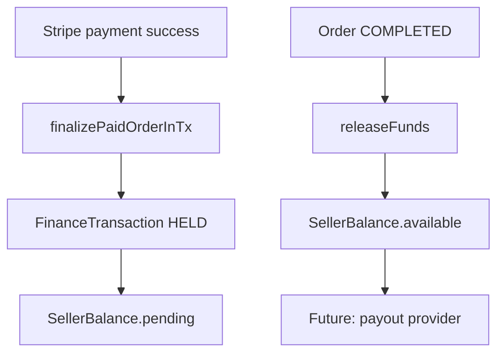

# Marketplace Finance Layer (EPIC-FINANCE-001)

Foundation for marketplace-controlled money flow — **not** production payouts or legal escrow.

---

## Architecture

```
lib/finance/
  commission.ts    — category rules + default %
  transaction.ts   — PENDING → PAID → HELD → RELEASED
  balance.ts       — seller virtual ledger
  permissions.ts   — seller/buyer access
  queries.ts       — admin dashboard + OMS hooks
  integrations     — syncFinanceOnPaymentInTx / syncFinanceOnOrderCompleted
```



---

## Data model

### FinanceTransaction

One row per order. Status: `PENDING | PAID | HELD | RELEASED | REFUNDED | DISPUTED`.

| Field | Description |
|-------|-------------|
| grossAmount | Order total charged |
| commissionAmount | Marketplace fee |
| sellerAmount | Net to seller |

### CommissionRule

Category-specific or default (`categoryId = null`). Seeded: tools 8%, electronics 5%, default 10%.

### SellerBalance

| Field | Meaning |
|-------|---------|
| pendingAmount | Held until order COMPLETED |
| availableAmount | Released, future payout |
| paidAmount | Historical payouts (placeholder) |

### Dispute

Foundation for buyer protection — `OPEN | UNDER_REVIEW | RESOLVED_*`. No full arbitration UI.

---

## OMS integration

| OMS event | Finance action |
|-----------|----------------|
| Payment finalized | `syncFinanceOnPaymentInTx` → create + PAID + HELD |
| Order COMPLETED | `syncFinanceOnOrderCompleted` → RELEASED |

Existing order statuses and transition engine unchanged.

---

## UX

| Surface | Path |
|---------|------|
| Seller balance | `/account/balance` |
| Buyer trust | Order detail — «Безопасная сделка» block |
| Admin finance | `/admin/finance` |

No withdrawal UI in MVP.

---

## Analytics (additive)

`transaction_created`, `payment_held`, `payment_released`, `refund_created`, `dispute_created` — no PII.

---

## Current MVP

- Virtual ledger + commission engine
- Hold until COMPLETED
- Seller pending/available balance display
- Admin turnover dashboard

---

## Future

| Phase | Capability |
|-------|------------|
| Payments | Provider split / marketplace account |
| Payouts | Bank / wallet withdrawals |
| Legal | Escrow agreement, KYC |
| Refunds | Stripe refund webhook + balance reversal |
| Disputes | Full dispute center + admin resolution |

---

## Operations

```bash
npx prisma migrate deploy
npx prisma db seed   # commission rules
npm run test -- tests/finance.test.ts
npx playwright test tests/e2e/finance.spec.ts
```

---

## Migration safety

- Additive schema only
- Existing orders/payments continue to work without finance rows
- Finance sync is idempotent per order
