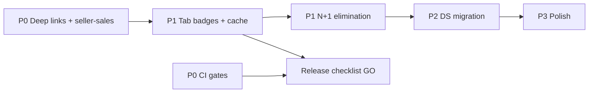

# EPIC 88 — Technical Debt Backlog

> **Baseline:** Closed Alpha `0.1.5-alpha` (token-fix)  
> **Source:** EPIC 88 Commerce Foundation Hardening audit  
> **Estimates:** Engineering days (1 dev, familiar with codebase)  
> **Rule:** P0 = release blocker or data correctness; execute before Seller Experience EPIC

---

## Summary

| Priority | Count | Total estimate |
|----------|-------|----------------|
| P0 | 5 | 8–12 days |
| P1 | 12 | 18–26 days |
| P2 | 10 | 12–18 days |
| P3 | 8 | 8–12 days |
| **Total** | **35** | **46–68 days** |

---

## P0 — Release blockers / data correctness

| ID | Item | Area | Estimate | Files / notes |
|----|------|------|----------|---------------|
| P0-1 | Fix deep link `lot://order/{id}` → route to `/order/[id]` not orders list | Navigation | 0.5d | `route-deep-link.ts:32-34` |
| P0-2 | Fix deep link `lot://seller/{id}` → catalog filtered by sellerId | Navigation | 1d | `route-deep-link.ts:35-37`, catalog query param |
| P0-3 | Fix seller-sales tab — use seller orders API, not buyer orders re-export | Navigation | 2d | `seller-sales.tsx`, new seller orders hook |
| P0-4 | Token architecture guard in CI — block PR if `theme/tokens` imports components | Dependencies | 0.5d | Gate exists; wire to CI |
| P0-5 | Route graph gate in CI — block PR if route modules fail probe | Dependencies | 0.5d | Gate exists; wire to CI |

---

## P1 — High commerce impact

| ID | Item | Area | Estimate | Files / notes |
|----|------|------|----------|---------------|
| P1-1 | Throttle/debounce `useTabBadges` — cache TTL 30s; event-driven refresh on mutations | API / Perf | 2d | `useTabBadges.ts`, mutation hooks |
| P1-2 | Introduce lightweight request cache for cart, favorites, categories, popular catalog | API | 3d | New `api/request-cache.ts` or React Query |
| P1-3 | Eliminate orders list N+1 — batch preview API or include fields in list response | API | 2d | `useOrdersData.ts`, backend |
| P1-4 | Eliminate cart/checkout N+1 product enrichment | API | 2d | `useCartData.ts`, `useCheckoutData.ts`, backend |
| P1-5 | Migrate favorites tab to DS + feature hook | Design / Components | 2d | `favorites.tsx` → `FavoritesExperience` |
| P1-6 | Add `@shopify/flash-list` for catalog grid | Performance | 1.5d | `CatalogDiscoveryExperience.tsx` |
| P1-7 | Fix catalog `listHeader` useMemo — narrow deps to primitives | Performance | 0.5d | `CatalogDiscoveryExperience.tsx:104` |
| P1-8 | Add `cachePolicy="memory-disk"` to legacy ProductCard / SellerProductCard | Performance | 0.5d | `components/ui/ProductCard.tsx` |
| P1-9 | Replace hardcoded HEX in DS components with semantic tokens | Design | 1d | `PdpStickyCta`, `CatalogProductCard`, etc. |
| P1-10 | Wire or remove dead endpoints `fetchMobileConfig`, `fetchNavigation` | API | 1d | `endpoints.ts` |
| P1-11 | Use `fetchBuyerHome` on home screen OR remove endpoint | API | 2d | `useBuyerHomeData.ts` refactor |
| P1-12 | Unify offline detection — align NetworkBanner with `isInternetReachable` | API / UX | 1d | `NetworkBanner.tsx`, `connectivity-check.ts` |

---

## P2 — Maintainability / consistency

| ID | Item | Area | Estimate | Files / notes |
|----|------|------|----------|---------------|
| P2-1 | Extract `CommerceOfflineState` DS component | Components | 1d | All feature experiences |
| P2-2 | Consolidate recommendation rail internals (home/cart/orders) | Components | 2d | 3 rail components |
| P2-3 | Migrate profile tab to DS feature module | Design | 2d | `profile.tsx` |
| P2-4 | Migrate wallet tab to DS + feature hook | Design | 2d | `wallet.tsx` |
| P2-5 | Migrate seller home/products to DS | Design | 3d | Seller tabs |
| P2-6 | Replace `Alert.alert` with DS dialog/bottom sheet | Design | 1.5d | `seller-products.tsx`, profile |
| P2-7 | Eliminate DS → legacy imports (Shimmer, GhostButton, TabBarBadge) | Dependencies | 2d | 8 DS files |
| P2-8 | Replace barrel imports from `components/ui/index.ts` | Dependencies | 1.5d | ~26 consumers |
| P2-9 | Memoize ProductCard, TabBarIcon, TabBarBadge | Performance | 1d | Legacy + tab layout |
| P2-10 | Add bundle analysis script | Performance | 0.5d | `apps/mobile/package.json` |

---

## P3 — Polish / future scale

| ID | Item | Area | Estimate | Files / notes |
|----|------|------|----------|---------------|
| P3-1 | Virtualize orders list (SectionList/FlashList) when >10 items | Performance | 1.5d | `OrdersExperience.tsx` |
| P3-2 | Virtualize cart lines when cart grows | Performance | 1d | `CartExperience.tsx` |
| P3-3 | Consolidate buyer home duplicate `fetchCatalog` calls | API | 1d | `useBuyerHomeData.ts` |
| P3-4 | Add pagination to seller products list | API | 1d | `seller-products.tsx` |
| P3-5 | Define global dynamic type policy (`maxFontSizeMultiplier`) | A11y | 1d | DS Text wrapper |
| P3-6 | Add card-level a11y to legacy ProductCard | A11y | 0.5d | `ProductCard.tsx` |
| P3-7 | Label profile/wallet pressables for screen readers | A11y | 0.5d | Profile, wallet screens |
| P3-8 | Replace tab/stack fade animations with platform default | Performance | 0.5d | `_layout.tsx` files |

---

## Recommended execution order

### Sprint A — Correctness (before Seller Experience)

```
P0-1 → P0-2 → P0-3 → P0-4 → P0-5
```

**Estimate:** 4–5 days  
**Exit criteria:** Deep links work; seller sales shows seller data; CI gates active

### Sprint B — Performance + API foundation

```
P1-1 → P1-2 → P1-3 → P1-4 → P1-6 → P1-7
```

**Estimate:** 10–12 days  
**Exit criteria:** Tab switch feels snappy; orders/cart load without N+1 storm

### Sprint C — Design system completion

```
P1-5 → P1-9 → P2-3 → P2-4 → P2-5 → P2-6 → P2-7
```

**Estimate:** 12–15 days  
**Exit criteria:** All commerce tabs DS-compliant; no Alert.alert; no legacy HEX in DS

### Sprint D — Polish

```
P2-1 → P2-2 → P3-* (as capacity allows)
```

**Estimate:** 8–12 days  
**Exit criteria:** Unified offline/empty patterns; a11y baseline; backlog P3 deferred OK

---

## Dependencies between items



---

## Items explicitly deferred (do not implement in EPIC 88)

| Item | Reason |
|------|--------|
| Startup code changes | Constraint: all P0 startup CLOSED |
| Unified ProductCard abstraction | Over-engineering per audit |
| React Query full migration | P1-2 lightweight cache sufficient first |
| Custom fonts | System fonts OK for alpha |
| Toast/Modal registry expansion | P2 after seller DS migration |

---

## Tracking

Update this backlog as items complete. Link PRs to IDs (e.g. `P1-1: throttle tab badges`).

Gate status after each sprint:

```bash
npm run mobile:epic-88:gate
```

Reference: `docs/product/EPIC_88_COMMERCE_FOUNDATION_HARDENING.md`
