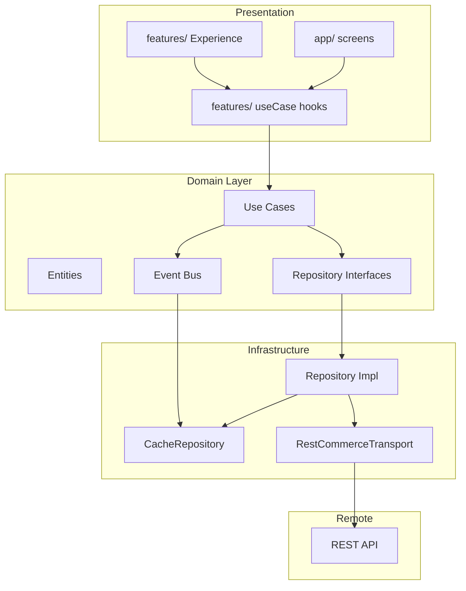

# EPIC 91 — Commerce Domain Platform

**Status:** COMPLETE (Architecture)  
**Baseline:** Closed Alpha 0.1.5-alpha · Sprint 90 COMPLETE · Unified Design System COMPLETE · Startup P0 CLOSED  
**Branch:** `cursor/epic-91-commerce-domain-platform-d03e`  
**Scope:** Architecture only — **no application code modified**

---

## Executive Summary

The mobile app today follows a **UI → API** pattern. Screens and hooks call `api/endpoints.ts` directly; DTO types leak into design-system components; state is fragmented across Zustand flags, hook-local `useState`, and ad-hoc SecureStore caches.

EPIC 91 defines the target **UI → Domain → Repositories → API** platform that will power both Buyer and Seller experiences. Implementation is deferred to Sprint 92+.

| Metric | Current | Target (designed) |
|--------|---------|-------------------|
| Domain modules | 0 | 22 |
| Repositories | 0 | 16 |
| Use cases | 0 | 42 |
| Direct API import sites | 40 | 0 |
| Screen API violations | 7 | 0 |
| Design-system API violations | 5 | 0 |

---

## Part 1 — Domain Inventory

Full inventory: `artifacts/epic-91-domain/domain-map.json`

### Domain summary (22 domains)

| Domain | Maturity | Primary paths | Key problem |
|--------|----------|---------------|-------------|
| Authentication | Partial | `api/client`, `secure-session`, `boot/session-restore` | No AuthRepository |
| Buyer | Partial | `features/buyer-home/` | Mutations in Experience |
| Seller | Partial | 3 fat screens + 1 hook | No SellerRepository |
| Catalog | Good hook | `features/catalog-discovery/` | 6 duplicate fetch sites |
| Search | Partial | `search-history`, catalog hook | No SearchRepository |
| Product | Good hook | `features/product-detail/` | DS rail calls toggleFavorite |
| Favorites | **Missing module** | `favorites.tsx` only | 8 toggle call sites |
| Cart | Good hook | `features/cart-checkout/` | DS rail calls addToCart |
| Checkout | Partial | `useCheckoutData` | Alpha web redirect |
| Orders | Good hook | `features/orders/` | Share in Experience |
| Wallet | **Missing module** | `wallet.tsx` | Direct API |
| Notifications | Missing | — | Not implemented |
| Profile | **Missing module** | `profile.tsx` | 5 inline API calls |
| Telemetry | Fragmented | 17 `postTelemetry` sites | No event catalog |
| Startup | Good | `boot/run-startup-pipeline` | Imports endpoints directly |
| Configuration | Partial | `fetchRemoteConfig`, store | Dead endpoints |
| Deep Links | **Best boundary** | `deep-links/*` pure functions | Pending link in store only |
| Offline | Inconsistent | NetworkBanner + mixed caches | Seller not persisted |
| Caching | Fragmented | 4 storage modules | No unified layer |
| Analytics | Minimal | postTelemetry subset | No typed events |
| Permissions | Stub | `camera/media-permissions` | Camera only |
| Feature Flags | Untyped | remoteConfig blob | No FeatureFlagService |

---

## Part 2 — Domain Boundaries

Each domain exposes:

| Surface | Description |
|---------|-------------|
| **Public API** | Repository interfaces + use cases consumed by hooks |
| **Internal API** | Entity parsers, cache keys, mappers (not exported to UI) |
| **Events** | Domain events emitted on state change |
| **State** | Owned entities (see Part 5) |
| **Repositories** | See Part 3 |
| **DTO mapping** | Inside repository impl only |
| **Caching** | Declared per repository method |
| **Offline policy** | Declared per repository method |
| **Retry policy** | Declared per repository method |
| **Telemetry** | `{domain}.{action}` via TelemetryRepository |
| **Dependencies** | One-way; no screen imports |

**Boundary rule:** No domain may import from `app/`, `features/`, or `design-system/`.

Guidelines: `docs/product/COMMERCE_DOMAIN_GUIDELINES.md`

---

## Part 3 — Repository Layer

Full map: `artifacts/epic-91-domain/repository-map.json`

### Repositories (16)

| Repository | Domain | Key methods |
|------------|--------|-------------|
| AuthRepository | authentication | login, logout, restoreSession |
| CatalogRepository | catalog | loadCatalog, loadCategories |
| SearchRepository | search | suggest, getHistory, pushHistory |
| ProductRepository | product | loadProduct, recordRecentView |
| FavoritesRepository | favorites | loadFavorites, toggleFavorite |
| CartRepository | cart | loadCart, addItem, updateQuantity, removeItem |
| CheckoutRepository | checkout | quoteDelivery, loadPickupPoints |
| OrderRepository | orders | loadOrders, loadOrderDetail |
| SellerRepository | seller | loadSellerHome, loadSellerProducts, loadSellerOrders, loadPublicProfile |
| WalletRepository | wallet | loadWallet, loadRecentSellerSales |
| ProfileRepository | profile | loadProfile, submitFeedback, setAppMode |
| BootstrapRepository | startup | runBootstrap, checkUpdate |
| ConfigRepository | configuration | loadRemoteConfig, getFlag |
| TelemetryRepository | telemetry | track, flush |
| DeepLinkRepository | deep-links | parse, resolve, queuePending |
| CacheRepository | caching | get, set, invalidate |

Transport isolated in `RestCommerceTransport` — sole importer of `api/endpoints.ts`.

**Designed repository cycles: 0**

---

## Part 4 — Use Cases

Full map: `artifacts/epic-91-domain/usecase-map.json`

### Use cases (42)

Grouped by domain:

- **Auth (3):** LoginUser, LogoutUser, RestoreSession
- **Startup (2):** RunStartupBootstrap, DeferAppUpdate
- **Buyer (2):** LoadBuyerHome, RefreshTabBadges
- **Catalog (2):** LoadCatalog, LoadCategories
- **Search (3):** SearchProducts, ClearSearchHistory, (suggest via SearchRepository)
- **Product (4):** LoadProduct, LoadRelatedProducts, ShareProduct, RecordRecentView
- **Favorites (2):** ToggleFavorite, LoadFavorites
- **Cart (4):** AddToCart, UpdateCartQuantity, RemoveFromCart, LoadCart
- **Checkout (3):** QuoteCheckoutDelivery, LoadPickupPoints, CreateOrder
- **Orders (3):** LoadOrders, LoadOrderDetail, ShareOrder
- **Wallet (1):** LoadWallet
- **Seller (4):** LoadSellerHome, LoadSellerProducts, LoadSellerOrders, LoadSellerPublicProfile
- **Profile (3):** LoadProfile, SubmitProductFeedback, SwitchAppMode
- **Platform (5):** HandleDeepLink, TrackDomainEvent, LoadRemoteConfig, CheckFeatureFlag, ObserveConnectivity, InvalidateCache, RequestCameraPermission

Each use case specifies: Input, Output, Errors, Telemetry, Offline, Retry — **no React dependency**.

---

## Part 5 — State Architecture

Full map: `artifacts/epic-91-domain/state-map.json`

### Classification

| Type | Current owner | Target owner |
|------|---------------|--------------|
| UI State | Experience `useState` | Experience (unchanged) |
| Domain State | `use*Data` hooks | Repository + domain store slice |
| Persistent State | `storage/*` ad-hoc | CacheRepository |
| Session State | `useAppStore` | SessionStore + ConnectivityStore |
| Derived State | Mixed (badges) | Selectors only — no dual writers |

### P1 ownership violations

1. **badges.cart** — written by `useTabBadges` AND `useCartData`
2. **Favorites list** — `favorites.tsx` + `useTabBadges` independent fetches
3. **Catalog products** — 6 `fetchCatalog` call sites without shared cache
4. **Seller orders** — `wallet.tsx` + `useSellerSalesData` duplicate logic

---

## Part 6 — Domain Events

Event bus (UI-agnostic):

| Event | Payload | Subscribers |
|-------|---------|-------------|
| `CartUpdated` | `{ cart: Cart }` | Badge projection, telemetry |
| `FavoriteAdded` | `{ productId }` | Badge projection, catalog cards |
| `FavoriteRemoved` | `{ productId }` | Badge projection |
| `OrderCreated` | `{ orderId }` | Orders cache invalidation, badges |
| `SellerOrderChanged` | `{ orderId }` | Seller home, wallet, sales sync |
| `WalletUpdated` | `{ balance }` | Wallet screen, seller home |
| `ProfileUpdated` | `{ profile }` | Profile screen |
| `SessionExpired` | `{}` | Auth redirect, clear caches |
| `ConnectivityChanged` | `{ offline }` | Offline policy orchestrator |

Events emitted by use cases; consumed by stores and telemetry — **never by design-system**.

---

## Part 7 — Error Model

Unified `DomainError` for the entire application:

| Code | Source | Retryable | UI treatment |
|------|--------|-----------|--------------|
| `network` | fetch failure | yes | SectionErrorCard + retry |
| `authentication` | 401 / session expired | no | Redirect login |
| `validation` | form/checkout | no | Inline field error |
| `business` | stock, rules | no | Toast / inline message |
| `server` | 5xx | yes | ErrorState + retry |
| `offline` | policy block | no | Offline banner + cache |
| `timeout` | AbortSignal | yes | Retry |
| `cancellation` | user abort | no | Silent |
| `unknown` | unmapped | maybe | Generic error |

`ApiClientError` maps to `DomainError` **only** in transport layer.

---

## Part 8 — Cache Architecture (Design Only)

Not implemented in EPIC 91 — architecture specification:

```
┌─────────────┐     ┌──────────────┐     ┌─────────────┐
│  L1 Memory  │ ──► │ L2 SecureStore│ ──► │  Network    │
│  LRU 1-5min │     │  TTL 24h-7d  │     │  REST API   │
└─────────────┘     └──────────────┘     └─────────────┘
        ▲                    ▲
        └──── CacheRepository ┘
              ▲
        Domain Events (invalidation)
```

| Policy | Strategy |
|--------|----------|
| TTL | Per-entity: catalog 5m, wallet 60s, config 24h |
| Invalidation | Event-driven + manual scope clear |
| Refresh | Stale-while-revalidate online |
| Conflict | Server wins; optimistic rollback on mutation |
| Offline | Per-domain matrix (see Guidelines §9) |
| Seller snapshots | EPIC 92 — promote in-memory Map to SecureStore |

---

## Part 9 — Seller Readiness (EPIC 86)

Full report: `artifacts/epic-91-domain/seller-readiness.json`

| Screen | UI ready (Sprint 90) | Domain ready | Blocker |
|--------|---------------------|--------------|---------|
| Seller Home | ✅ | ❌ | Fat screen; no SellerRepository |
| Seller Products | ✅ | ❌ | Fat screen; no feature module |
| Seller Sales | ✅ | ⚠️ | Hook pattern OK; API direct |
| Public Seller Profile | ✅ | ⚠️ | Orchestrator OK; API direct |
| Wallet (seller mode) | ✅ | ❌ | Mixed concerns; duplicate orders fetch |
| Profile mode switch | ✅ | ⚠️ | setMode in screen |

**EPIC 86 can start UI work:** No — domain foundation required first.

**Missing P0 capabilities:** SellerRepository, Seller domain entities, WalletRepository, persistent seller offline cache.

---

## Part 10 — Architecture Validation

Report: `artifacts/epic-91-domain/dependency-report.json`

### Current violations (baseline audit)

| Check | Result |
|-------|--------|
| Screens import REST DTOs | ❌ FAIL — 7 screens, 26 DTO leak sites |
| Screens import API client | ❌ FAIL — 7 files |
| API in design-system | ❌ FAIL — 5 files (3 with live mutations) |
| Feature owns another feature's state | ❌ FAIL — badges, favorites duplication |
| Domain cycles | ✅ N/A — no domain layer yet |
| Repository cycles | ✅ 0 — in designed architecture |
| Feature-layer import cycles | ✅ 0 — madge clean |

### Target gates (Sprint 92+)

```bash
npm run mobile:epic-91:validate   # future
```

---

## Target Architecture Diagram



---

## Deliverables

| Artifact | Path |
|----------|------|
| EPIC document | `docs/product/EPIC_91_COMMERCE_DOMAIN_PLATFORM.md` |
| Guidelines | `docs/product/COMMERCE_DOMAIN_GUIDELINES.md` |
| Domain map | `artifacts/epic-91-domain/domain-map.json` |
| Repository map | `artifacts/epic-91-domain/repository-map.json` |
| Use case map | `artifacts/epic-91-domain/usecase-map.json` |
| State map | `artifacts/epic-91-domain/state-map.json` |
| Dependency report | `artifacts/epic-91-domain/dependency-report.json` |
| Seller readiness | `artifacts/epic-91-domain/seller-readiness.json` |

---

## Acceptance Checklist

- [x] Domain inventory complete (22 domains)
- [x] Repository architecture complete (16 repositories)
- [x] Use case architecture complete (42 use cases)
- [x] State ownership defined
- [x] Unified error model specified
- [x] Unified cache strategy specified
- [x] Seller readiness documented
- [x] No application code modified

---

## Final Report

| Metric | Value |
|--------|-------|
| **Domains** | **22** |
| **Repositories** | **16** |
| **Use Cases** | **42** |
| **Domain Cycles** | **0** (designed) |
| **Repository Cycles** | **0** (designed) |
| **Architecture Ready** | **YES** |
| **Seller Ready** | **NO** |
| **Recommended Next Sprint** | **Sprint 92 — Domain Foundation Implementation** (Auth + Catalog + Cart repositories; migrate fat screens; remove DS API mutations) |

---

## Recommended Sprint 92 Scope

1. Create `apps/mobile/src/domain/` scaffold + `DomainError` + event bus interface
2. Implement `RestCommerceTransport` wrapping existing endpoints
3. Ship `AuthRepository`, `CatalogRepository`, `CartRepository` + 8 priority use cases
4. Migrate `favorites.tsx`, `wallet.tsx` to feature hooks calling use cases
5. Remove `addToCart`/`toggleFavorite` from design-system recommendation rails
6. Add architecture validation gate to CI

No Seller UI work until SellerRepository lands (Sprint 93 candidate).
